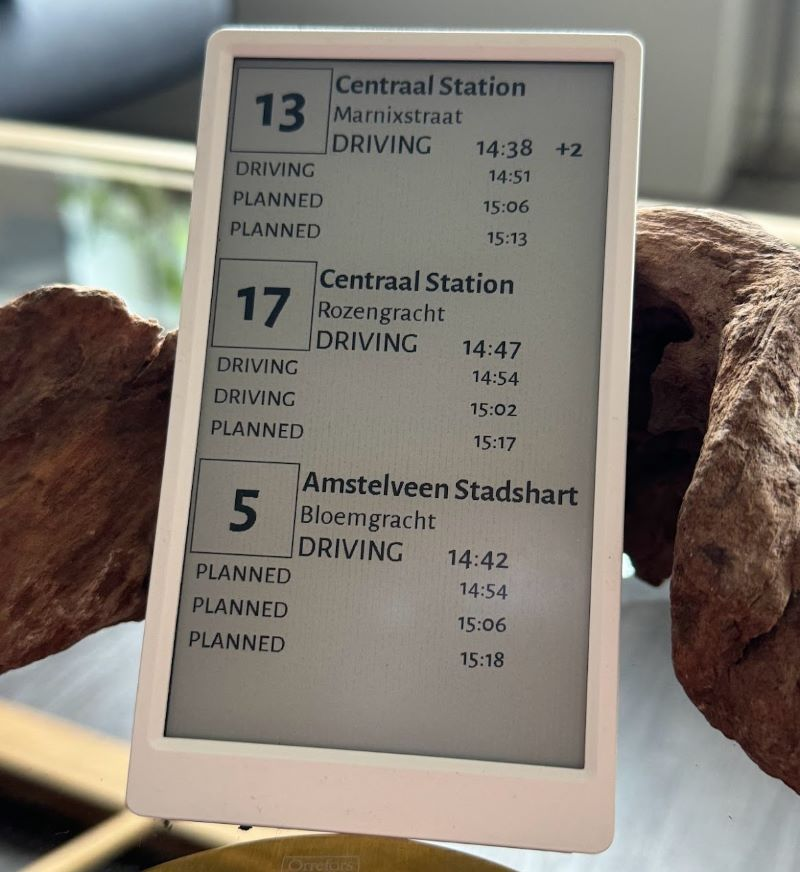

# Openbaar vervoer "stop display" for M5Paper



## Requires

- M5Paper
- ESP-IDF 5.0

## Build

You'll need to deploy the Cloudflare worker in [https://github.com/rosmo/ovapi-cfworker](rosmo/ovapi-cfworker) with
your lines (eg. `GVB_LineNumber_Direction` and stop number (`TimingPointCode`)). Then run the configuration and
set your Cloudflare worker URL and WiFi details. To find your stop numbers, open the line URL with your
browser for the line, eg: `https://v0.ovapi.nl/line/GVB_5_2`, search for your stop name and note down the `TimingPointCode`.

```sh
idf.py menuconfig
idf.py build
idf.py -p com3 flash
```
